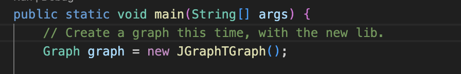

# گزارش آزمایش ۸

## بخش اول: پیاده‌سازی الگوریتم Adapter
### زیربخش ۱ - انتخاب نوع Adapter
از روش Object Scope استفاده کردیم.

زیرا در اینجا احتیاجی به دسترسی به فیلدها و متدهای داخلی کلاس SparseMultigraph نداریم و مزیت روش class scope در اینجا کاربردی ندارد.

در روش class scope وابستگی به adaptee بیشتر است و از آن‌جایی که در اینجا اطلاع زیادی از کلاس SparseMultigraph و جزئیات داخل آن نداریم ترجیح دادیم وابستگی به آن را به حداقل برسانیم پس از روش object scope استفاده کردیم. برای مثال ممکن بود signature متدهای این کلاس با Graph interface تداخل داشته باشد.

### زیربخش ۲ - نحوه‌ی پیاده‌سازی الگو
ابتدا استفاده‌هایی که در کلاس‌های مختلف از کلاس SparseMultigraph داشتیم را شناسایی کردیم و بر اساس آن‌ها متدهای interface زیر را مشخص کردیم:

این interface در واقع Adapter ماست.

در ادامه این متدها را در یک کلاس برای کتابخانه‌ی JUNG پیاده‌سازی کردیم:

سپس استفاده‌هایی که در کلاس‌های Traverser و کلاس Main از SparseMultigraph داشتیم را با interface جدید جایگزین کردیم و هنگام ساختن گراف جدید در کلاس Main به جای یک آبجکت از کتابخانه‌ی JUNG، یک آبجکت از JUNGGraph ساختیم.

## بخش دوم: تغییر کتابخانه از JUNGGraph به TGraph
### زیربخش ۱ - چگونگی تغییرات
مهم‌ترین نکته در این تغییرات، سادگی و حداقلی بودن آن، در نتیجه‌ی استفاده از پترن Adaptor می‌باشد.
همان‌طور که زیربخش ۲ نیز قابل مشاهده خواهد بود، برای اعمال این تغییر، فقط کلاس Adapter مربوطه (که قبلاً JUNGGraph نام داشت) با نسخه‌ای جدید تحت عنوان JGraphTGraph جایگزین شد. این کلاس به پیاده‌سازی رابط Graph ادامه می‌دهد و از SimpleGraph موجود در JGraphT برای مدل‌سازی گراف استفاده می‌کند.

مهاجرت از JUNG به JGraphT نیازمند تغییر در نوع داده‌های گراف از SparseMultigraph به SimpleGraph بود. همچنین، به‌جای استفاده از ساختار Edge با شناسه‌ی مشخص (Label)، از DefaultEdge داخلی JGraphT استفاده شد.

### زیربخش ۲ - بررسی و اثرات تغییرات
در این بخش به بررسی تغییرات و اثرات آن می‌پردازیم.

همانطور که در بخش قبل توضیح داده شد. برای پیاده‌سازی این مورد ابتدا کلاس JGraphTGraph در مسیر LibraryChange02 ایجاد شده که رابط گرافی جدید را پیاده‌سازی می‌کند. در این کلاس، از <SimpleGraph<Integer, DefaultEdge برای مدل‌سازی گراف استفاده شد. در JGraphT برای گراف‌های ساده‌ی بدون وزن و بدون جهت معمولا از این روش استفاده می‌‌شود. در انتها نیز متدهای addVertex، addEdge و getNeighbors به‌گونه‌ای پیاده‌سازی شدند که با ساختار داخلی JGraphT سازگار باشند، اما رفتار آن‌ها برای کاربر نهایی (یعنی سایر کلاس‌ها) تغییر نکند.
خروجی نهایی در تصویر زیر قابل مشاهده می‌باشد:

در ادامه نیز، تنها برای تکمیل پیاده‌سازی، در کلاس Main هم JGraphTGraph را جایگزین JUNGGraph کردیم. باقی کدها بدون تغییر باقی ماندند.

شایان ذکر است، که در پروسه مهاجرت، منطق داخلی کلاس Adapter تغییر کرد ولی کلاس‌های استفاده‌کننده (مثل DfsGraphTraverser، BfsGraphTraverser) بدون تغییر باقی ماندند که این نشان‌دهنده‌ی پیاده‌سازی صحیح الگوی Adapter در پروژه است.

## بخش سوم: تحلیل وجود الگوی strategy 
### سوال اول - علت قابل قبول بودن استفاده از این پترن 
استفاده از این الگو در این پروژه برایمان قابل قبول است چون به ما این امکان را میدهد تا الگوریتم های مختلف پیمایش گراف (عمق اول و سطح اول) را جداگانه و مستقل پیاده سازی کنیم بدون اینکه نیاز باشد ساختار کلی برنامه را عوض کنیم. اینطوری اگر بخواهیم الگوریتم جدیدی اضافه کنیم یا تغییری در پیاده سازی الگوریتم های فعلی بدهیم، تنها کافیست یک کلاس جدید بسازیم و تغییرات را اعمال کنیم. پیاده سازی این الگو در این پروژه باعث میشود کد تمیزتر و قابل توسعه تر و منعطف تر باشد.

### سوال دوم - روش تحقق این الگو 
یک اینترفیس به اسم Traverse طراحی شده که تنها متد traverse را دارد. دو کلاس BfsGraphTraverser و DfsGraphTraverser این اینترفیس را پیاده سازی کرده اند و هرکدام الگوریتم پیمایش گراف مخصوص خودشان را دارند. توی کلاس Main هم فقط کافیست هریک از این استراتژی ها را به جای این اینترفیس پاس بدیم تا گراف با روش پیمایش شود.
